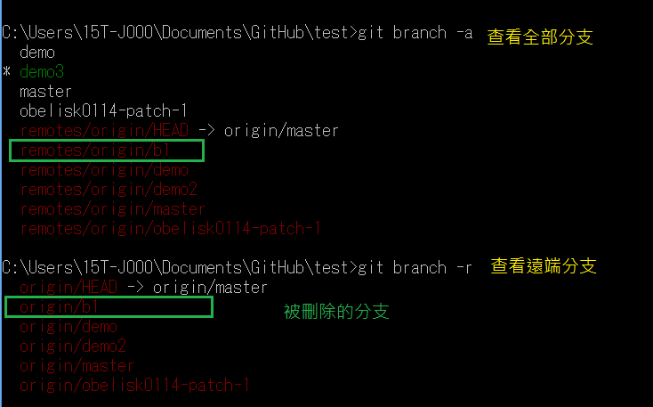
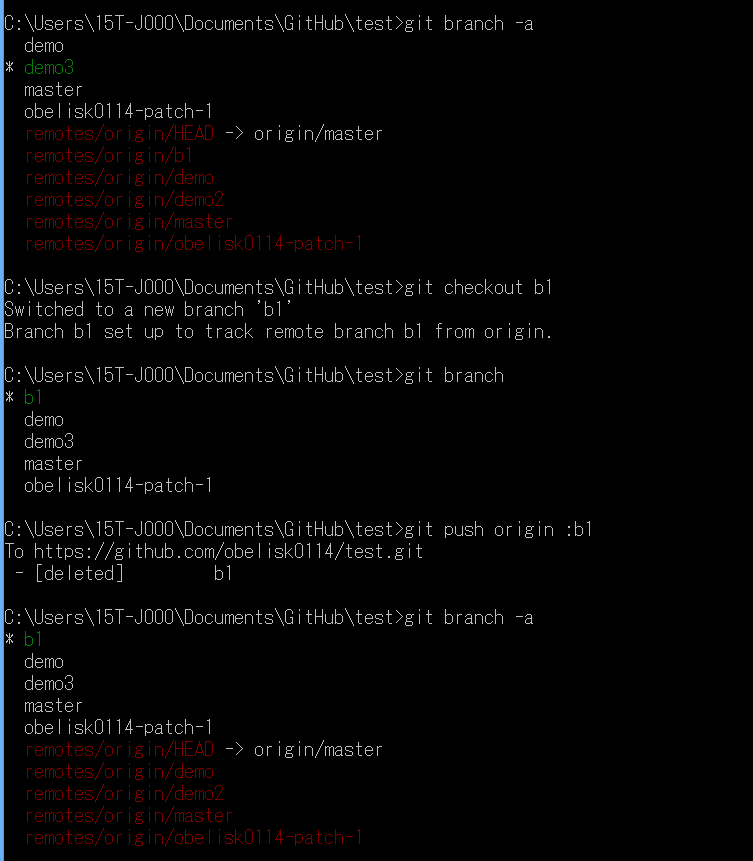
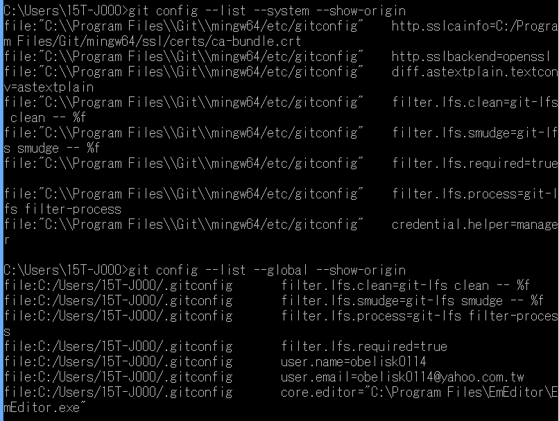
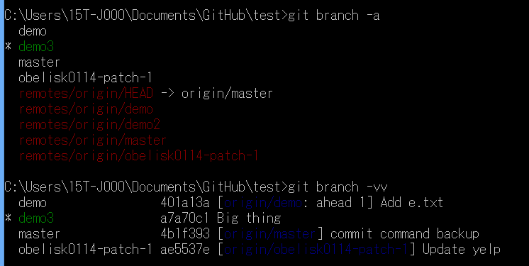
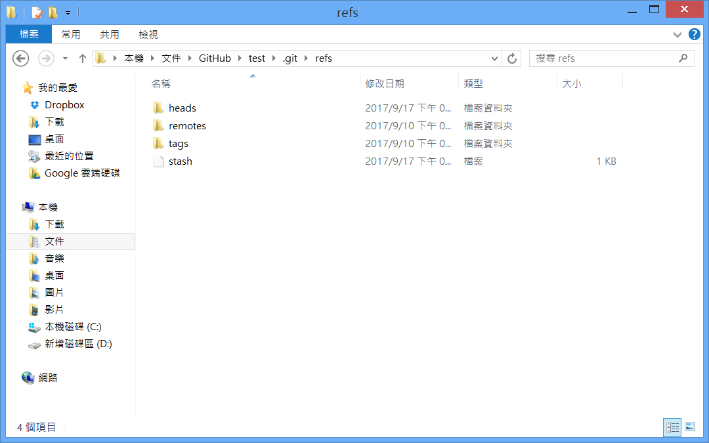

# 個人筆記區 #
做一些記錄來補充 30 天速成 Git 之不足

## 解決在命令提示字元下使用 Git for Windows 顯示中文的問題 ##

在 Windows 作業系統內部預設以 UTF-16 為預設字集編碼，如果要正常顯示在畫面上，通常會透過控制台中的地區設定進行自動轉換。而在 **繁體中文 (台灣)** 的語言設定下，命令提示字元是以 CP950 也就是 **Big5** 為預設字集，所以任何要顯示在命令提示字元的文字，都會在內部先行轉譯過才能正常輸出。不過要顯示 Big5 字集以外的 Unicode 文字，就必須要透過 `chcp` 命令來幫我們切換預設顯示字集。因此當你需要切換顯示字集的時候，可以試著輸入 `chcp 65001` 來切換成 Unicode 顯示模式。

不過 Git for Windows 內建的 **git.exe** 工具，畢竟是從 UNIX 環境下的工具轉換而來的，在 UNIX-like 作業系統環境下，預設在處理多國語系的時候，會讀取 **LC_ALL** 或 **LANG** 這個環境變數，依據這個環境變數來判斷如何顯示與轉換文字，如果沒有設定的話，就有可能無法正確顯示非英語系語言的文字。

要解決這個問題，只要設定好 **LC_ALL** 環境變數就可以解決。

畢竟 Git 在內部儲存 commit 紀錄的時候，預設都是以 UTF-8 為主要編碼，因此建議各位設定一個 **LC_ALL** 環境變數，將值設定為 **C.UTF-8** 即可解決此問題。

	set LC_ALL=C.UTF-8

如果你想要將 **LC_ALL** 環境變數設定在 **使用者環境變數** 中的話，只要透過 `SETX` 命令就可以快速設定完成，下次就不用再設定了：

	SETX LC_ALL C.UTF-8

[如何解決在命令提示字元下使用 Git for Windows 無法顯示中文的問題](https://blog.miniasp.com/post/2017/09/17/Git-for-Windows-Command-Prompt-Display-Chinese-Issues.aspx)

## 用 git prune 清理掉在 github 已經 deleted 的 local branch ##

在 GitHub 網頁刪除若干舊的 branch 之後，在 local 用 `git branch -r` 做 checkout branch，那些被刪除的 branch 依然會被列出來。

### 如何從 GitHub 網頁刪除 branch ###

進到要刪除的專案頁籤，點擊 **<number> branches** 處：

找出要刪除的 branch，點擊其右方的 **垃圾桶標示**：

### 使用 `git prune` 將從 GitHub 上刪除的 branch 從本地刪除 ###

先執行 `git branch -r` 查看遠端分支再用 `git branch` 查看本地進行比較，或是直接使用 `git branch -a` 查看全部分支，查看是否有從 GitHub 上刪除但還留在本地的分支：

輸入 `git remote prune origin --dry-run` ，查看模擬結果：

 `git prune` 是將失連的物件從儲存庫**修剪**的指令， `--dry-run` 參數是**不進行任何修剪**，**只回報將刪除哪些物件**：

[git prune 官方文件](https://git-scm.com/docs/git-prune)

執行下面指令刪除失連的分支

	git remote prune origin

## 刪除遠端分支 ##

	git push <remote name> :<branch name>

遠端名稱通常預設為 **origin**，所以指令是 `git push origin :<branch name>` 。

要注意此指令只會刪除遠端分支，不會刪除本地同名分支。

在 Git 1.7.0 之後，可以使用這種語法刪除遠程分支：

	git push origin --delete <branchName>

## git config 位置 ##

主要使用 `--show-origin` 選項來查看 `--system` 或是 `--global` config 的位置

	git config --list --show-origin

上面指令用於將所有 git configuration files 的位置取出

	git config --list --system --show-origin

上面指令將系統層級的 git configuration files 位置取出

[location of configuration files](https://www.onwebsecurity.com/configuration/git-on-windows-location-of-global-configuration-file.html)

[git config 官方文件](https://git-scm.com/docs/git-config)

### Local ###

存放位置都在目錄底下的 `.git` 資料夾

	.git/config

可以使用下面指令來確認

	git config --list --local

### System ###

Git for Windows (64 bit) 存放的相對位置如下：

	%ProgramFiles%\Git\mingw64\etc\gitconfig

### Global ###

放在下面位置：

	%USERPROFILE%\.gitconfig

## 遠端儲存庫 ##

使用該指令可查看遠端主機訊息：

	git remote show <remote name>

遠端名稱通常預設為 **origin**，所以指令是 `git remote show origin` 。

移除不存在的遠端參照：

	git fetch -p

Before fetching, remove any remote-tracking references that no longer exist on the remote. Tags are not subject to pruning if they are fetched only because of the default tag auto-following or due to a --tags option. However, if tags are fetched due to an explicit refspec (either on the command line or in the remote configuration, for example if the remote was cloned with the --mirror option), then they are also subject to pruning.

上面解釋來自官方文件。[git-fetch](https://git-scm.com/docs/git-fetch)

用 `git remote update -p` 一次幫你全部搞定。參數 `-p` 等同於 `--prune`，這個指令也可以用 `git fetch` 來代換：

	git fetch --all --prune

參考資料：[刪除遠端分支](https://zlargon.gitbooks.io/git-tutorial/content/remote/delete_branch.html)

官方文件：[git-remote](https://git-scm.com/docs/git-remote)

### 強制更新遠端分支 (危險！！！) ###

 `git push -f` 可以強迫上傳，並且覆蓋掉遠端的分支。參數 `-f` 等同於 `--force`

> 注意：
>
> 如果我們沒有設定 upstream 的話，後面還是要加 `<remote name>` 跟 `<branch name>` 
>
> `git push -f <remote name> <branch name>`

很可能會不小心把別人上傳的 code 整個覆蓋掉。通常只有在單人開發，或是非常有把握的時候，才會用 `git push -f` 來強制更新分支

## git branch ##

分支移動，重新命名。若是當前分支要更動可以省略 `<oldbranch>`， `-M` 是 `--move --force` 的簡寫

	git branch (-m | -M) [<oldbranch>] <newbranch>

 `git branch -r` 會列出本地所追蹤的遠端分支

 `git branch -vv` 會列出本地分支及對應的遠端追蹤分支

## 一、git clone ##

指定不同的目錄

	git clone <儲存庫的網址> <主機名>

## 二、git remote ##

列出所有遠端主機

	git remote

加上 `-v` 參數可以查看遠端主機的網址

clone 儲存庫時，所使用的遠端儲存庫會自動被 Git 命名為 `origin` 。如果想用其他名稱需要用 `git clone` 的參數 `-o` 。

	git clone -o <主機名> <儲存庫的網址>

 `git clone -o jQuery https://github.com/jquery/jquery.git` 這命令表示，clone 的時候，指定遠端主機叫做 `jQuery` 。

 `git remote show` 命令加上主機名，可以查看該主機的詳細訊息。

	git remote show <主機名>

 `git remote add` 命令用於添加遠端主機。

	git remote add <主機名> <網址>

 `git remote rm` 命令用於刪除遠端主機。

	git remote rm <主機名>

 `git remote rename` 命令用於遠端主機的改名。

	git remote rename <原主機名> <新主機名>

## 三、git fetch ##

一旦遠端儲存庫有了更新 (commit)，需要將這些更新取回本地，這時就要用到 `git fetch` 命令。

	git fetch <遠端主機名>

上面命令將某個遠端主機的更新，全部取回本地。

 `git fetch` 命令通常用來查看其他人的進度，因為它取回的 code 對你本地的開發程式碼沒有影響。

默認情況下， `git fetch` 取回所有分支 (branch) 的更新。如果只想取回特定分支的更新，可以指定分支名。

	git fetch <遠端主機名> <分支名>

比如取回 `origin` 主機的 `master` 分支。 `git fetch origin master` 

所取回的更新，在本地主機上要用 `" 遠程主機名/分支名 "` 的形式讀取。比如 `origin` 主機的 `master` ，就要用 `origin/master` 讀取。

 `git branch` 命令的 `-r` 參數，可以用來查看遠程分支， `-a` 參數查看所有分支。 完整指令為 `git branch -r` 以及 `git branch -a`

	git checkout -b newBrach origin/master

上面命令表示，在 `origin/master` 的基礎上，創建一個新分支。

## 四、git pull ##

 `git pull` 命令的作用是，取回遠程主機某個分支的更新，再與本地的指定分支合併。

	git pull <遠端主機名> <遠端分支名>:<本地分支名>

比如，取回 `origin` 主機的 `next` 分支，與本地的 `master` 分支合併

	git pull origin next:master

如果遠程分支是與當前分支合併，則冒號後面的部分可以省略。

	git pull origin next

上面命令表示，取回 `origin/next` 分支，再與當前分支合併。實質上，這等同於先做 `git fetch` ，再做 `git merge` 。

在某些場合，Git 會自動在本地分支與遠程分支之間，建立一種追踪關係 (tracking)。比如，在 `git clone` 的時候，所有本地分支默認與遠端主機的同名分支，建立追踪關係，也就是說，本地的 `master` 分支自動"追踪" `origin/master` 分支。

	git branch --set-upstream master origin/next

上面命令指定 `master` 分支追蹤 `origin/next` 分支。

如果當前分支與遠端分支存在追蹤關係， `git pull` 就可以省略遠程分支名。

	git pull origin

上面命令表示，本地的當前分支自動與對應的 `origin` 主機 "追踪分支"（remote-tracking branch）進行合併。如果當前分支只有一個追踪分支，連遠程主機名都可以省略。

如果合併需要採用 rebase 模式，可以使用 `--rebase` 選項。

	git pull --rebase <遠端主機名> <遠端分支名>:<本地分支名>

如果遠端主機刪除了某個分支，默認情況下， `git pull` 不會在拉取遠端分支的時候，刪除對應的本地分支。這是為了防止，由於其他人操作了遠端主機，導致 `git pull` 不知不覺刪除了本地分支。

加上參數 `-p` 就會在本地刪除遠端已經刪除的分支。

	git pull -p
	等同於下面的命令
	git fetch --prune origin
	git fetch -p

## 五、git push ##

 `git push` 命令用於將本地分支的更新，推送到遠端主機。它的格式與 `git pull` 命令相仿。

	git push <遠端主機名> <本地分支名>:<遠端分支名>

注意，分支推送順序的寫法是 **<來源地>:<目的地>** ，所以 `git pull` 是 **<遠端分支>:<本地分支>** ，而 `git push` 是 **<本地分支>:<遠端分支>**。

如果省略遠端分支名，則表示將本地分支推送與之存在 "追蹤關係" 的遠端分支（通常兩者同名），如果該遠端分支不存在，則會被新建。

 `git push origin master` 表示，將本地的 `master` 分支推送到 `origin` 主機的 `master` 分支。如果後者不存在，則會被新建。

如果省略本地分支名，則表示刪除指定的遠程分支，因為這等同於推送一個空的本地分支到遠程分支。

	git push origin :master
	等同於
	git push origin --delete master

上面命令表示刪除 `origin` 主機的 `master` 分支。

如果當前分支與遠程分支之間存在追踪關係，則本地分支和遠程分支都可以省略。

	git push origin

上面命令表示，將當前分支推送到 `origin` 主機的對應分支。如果當前分支只有一個追踪分支，那麼主機名都可以省略。

如果當前分支與多個主機存在追踪關係，則可以使用 `-u` 選項指定一個默認主機，這樣後面就可以不加任何參數使用 `git push` 。

	git push -u origin master

上面命令將本地的 `master` 分支推送到 `origin` 主機，同時指定 `origin` 為默認主機，後面就可以不加任何參數使用 `git push` 。

不帶任何參數的 `git push` ，默認只推送當前分支，這叫做 simple 方式。此外，還有一種 matching 方式，會推送所有有對應的遠端分支的本地分支。 Git 2.0 版本之前，默認採用 matching 方法，現在改為默認採用 simple 方式。如果要修改這個設置，可以採用 `git config` 命令。

	git config --global push.default simple

還有一種情況，就是不管是否存在對應的遠端分支，將本地的所有分支都推送到遠端主機，這時需要使用 `--all` 選項。

	git push --all origin

上面命令表示，將所有本地分支都推送到 `origin` 主機。

如果遠端主機的版本比本地版本更新，推送時 Git 會報錯，要求先在本地做 `git pull` 合併差異，然後再推送到遠端主機。這時，如果你一定要推送，可以使用 `--force` 選項。

 `git push` 不會推送標籤 (tag)，除非使用 `--tags` 選項。

	git push origin --tags

## Syncing a fork ##

1. 使用 `git remote -v` 列出所有遠端儲存庫資訊
2. 指定想要同步的上游儲存庫 `git remote add upstream https://github.com/ORIGINAL_OWNER/ORIGINAL_REPOSITORY.git` 
3. 再用 `git remote -v` 確認已經成功追蹤
4. Fetch the branches and their respective commits from the upstream repository. 使用指令 `git fetch upstream` 
5. 將本地端分支換到 `master` 。使用指令 `git checkout master`
6. 合併變更。執行指令 `git merge upstream/master` 。If your local branch didn't have any unique commits, Git will instead perform a "fast-forward"

[Configuring a remote for a fork](https://help.github.com/articles/configuring-a-remote-for-a-fork/)

[Syncing a fork](https://help.github.com/articles/syncing-a-fork/)

## 其他命令 ##

切換到你最後所在的分支

	git checkout -

 `cd` 命令有個類似的縮寫 `cd -`，表示切換到你最後所在的目錄。

顯示哪些分支是已經合併進你當前所在的分支

	git branch --merged

查看哪些分支還沒有合併進當前所在的分支，可以使用 `git branch --no-merged` 

從另一分支獲取文件內容而不用切換分支。

	git checkout (branch) -- (path/file)

可以直接檢出另一分支的文件，並且合併到你當前所在的工作分支，使用命令 (括號部分替換為對應的分支和文件)

 `git for-each-ref` 命令可以打印出一個列表，該列表顯示每個分支最後一次提交的引用 (reference) 信息。我們可以自定義輸出來包含一些有用的信息，更重要的是我們還可以按日期排序。可以使用下面的命令來輸出一個列表，該表將顯示按時間先後排序的每個分支的最後提交信息、提交者等信息：

	git for-each-ref --sort=-committerdate --format="%(committername)@%(refname:short) [%(committerdate:short)] %(contents)"

還可以把它定義在 `gitconfig` 裡：

	[alias]
	  latest = for-each-ref --sort=-committerdate --format=\"%(committername)@%(refname:short) [%(committerdate:short)] %(contents)\"

定義後就只需執行 `git latest` 了。注意雙引號需要轉義！

 `git blame` 用來顯示一份文件每一行的最近一次提交的提交hash值和提交者。

	git blame -w  # 忽略移除空白這類改動
	git blame -M  # 忽略移動文本內容這類改動
	git blame -C  # 忽略移動文本內容到其他文件這類改動

 `git rev-list` 反序列出 commit 物件。[git rev-list](https://git-scm.com/docs/git-rev-list)

 `git grep` 印出符合 pattern 的行數。 `-F` 參數表示不將 pattern 看成 `regex`。 `-n` 參數顯示行數。下面這個例子顯示所有出現 `xmmap` 的文件

	git grep xmmap

只顯示文件名，我們可以使用 `--name-only`。我們可以使用 `-c` 查看每個文件裡有多少行匹配內容(line matches)

如果我們要查找 Git 倉庫裡某個特定版本裡的內容，我們可以像下面一樣在命令行末尾加上標籤名 (tag reference)：

	git grep xmmap v1.5.0

 `-e` The next parameter is the pattern. This option has to be used for patterns starting with `-` and should be used in scripts passing user input to grep. Multiple patterns are combined by `or`.

 `--and` ， `--or` ， `--not` 布林表示匹配。 `--or` 是預設的作用， `--and` 比 `--or` 有較高的優先權。

[git grep](https://git-scm.com/docs/git-grep)

## Git stash 暫存工作區 ##

當我們想要保存當前工作目錄的狀態和索引，然而又需要回到一個乾淨的工作目錄，可以使用 `git stash`。

儲存在 `.git\refs`

最新的暫存檔儲存在 `refs/stash`，舊的暫存檔可以用參考的 reflog 找到。( `stash@{0}` 代表最新的暫存檔， `stash@{1}` 是前一個)。Stash 可以藉由指定索引 (`stash index`) 被參照。(e.g. the integer `n` is equivalent to `stash@{n}`).

	git stash save [-p|--patch] [-k|--[no-]keep-index] [-u|--include-untracked] [-a|--all] [-q|--quiet] [<message>]
	git stash push [-p|--patch] [-k|--[no-]keep-index] [-u|--include-untracked] [-a|--all] [-q|--quiet] [-m|--message <message>] [--] [<pathspec>…​]

 `git stash save --keep-index` 所有被加入 (add) 索引的檔案都保持。

 `git stash save --patch` 使用互動模式讓使用者可以藉由每個檔案的 `diff` 差異選擇是否加入這個檔案，不能和 `-u` 一起用。

下面表格是使用實際檔案執行這些指令的比較結果：

| 狀態   檔名 | head    |     目前工作狀態           | 加入參數   --keep-index | --keep-index   馬上 pop | 只有   git stash | git stash   馬上 pop  |
| :---             |  :--:   |        :--:                |          :--:                |          :--:                |      :--:             |        :--:                |
| 1                |   1     |  1                         |       1                      |     1                        | 1                     |   1                        |
| 2                |   2     | 15   (git add)        |      15   (git add)     |    15   (git add)       | 2                     |  15   (not staged)    |
| 3                | "沒有"  | 3   (git add)         |       3   (git add)     |     3   (git add)       | "沒有"                |   3   (git add)       |
| a                |   1     | 7   (not staged)      |       1                      |     7   (not staged)    | 1                     |   7   (not staged)    |
| b                |   2     | 8   (not staged)      |       2                      |     8   (not staged)    | 2                     |   8   (not staged)    |
| c                | 3C + 3Q | 3C + 3Q                    |    3C + 3Q                   |  3C + 3Q                     | 3C + 3Q               | 3C + 3Q                    |
| d                |   4     | 4                          |       4                      |     4                        | 4                     |   4                        |
| e                |   88    | "沒有"   (not staged) |      88                      |  "沒有"   (not staged)  | 88                    | "沒有"   (not staged) |
| f                | "沒有"  | f   (untracked)       |       f   (untracked)   |     f   (untracked)     | f   (untracked)  |   f   (untracked)     |

| 狀態   檔名 | head    |     目前工作狀態           | git stash save -u |  save -u   馬上 pop   | git stash save   --keep-index -u | save --keep-index -u   馬上 pop |
| :---             |  :--:   |        :--:                |        :--:       |         :--:               |                :--:                   |             :--:                     |
| 1                |   1     |  1                         |         1         |   1                        |               1                       |     1                                |
| 2                |   2     | 15   (git add)        |         2         |  15   (not staged)    |              15   (git add)      |    15   (git add)               |
| 3                | "沒有"  | 3   (git add)         |       "沒有"      |   3   (git add)       |               3   (git add)      |     3   (git add)               |
| a                |   1     | 7   (not staged)      |         1         |   7   (not staged)    |               1                       |     7   (not staged)            |
| b                |   2     | 8   (not staged)      |         2         |   8   (not staged)    |               2                       |     8   (not staged)            |
| c                | 3C + 3Q | 3C + 3Q                    |      3C + 3Q      | 3C + 3Q                    |             3C + 3Q                   |  3C + 3Q                             |
| d                |   4     | 4                          |         4         |   4                        |               4                       |     4                                |
| e                |   88    | "沒有"   (not staged) |        88         | "沒有"   (not staged) |              88                       |  "沒有"   (not staged)          |
| f                | "沒有"  | f   (untracked)       |      "沒有"       |   f   (untracked)     |            "沒有"                     |     f   (untracked)             |

| 狀態   檔名 | head    |     目前工作狀態           | git stash save -u --keep-index | git stash save -u --keep-index 馬上 pop |
| :---             |  :--:   |        :--:                |              :--:              |                  :--:                   |
| 1                |   1     |  1                         |             1                  |             1                           |
| 2                |   2     | 15   (git add)        |            15   (git add) |            15   (git add)          |
| 3                | "沒有"  | 3   (git add)         |             3   (git add) |             3   (git add)          |
| a                |   1     | 7   (not staged)      |             1                  |             7   (not staged)       |
| b                |   2     | 8   (not staged)      |             2                  |             8   (not staged)       |
| c                | 3C + 3Q | 3C + 3Q                    |           3C + 3Q              |          3C + 3Q                        |
| d                |   4     | 4                          |             4                  |             4                           |
| e                |   88    | "沒有"   (not staged) |            88                  |           "沒有"   (not staged)    |
| f                | "沒有"  | f   (untracked)       |          "沒有"                |             f   (untracked)        |

 `git stash pop <stash>` 從 stash list 裡面取出 `<stash>` 並移除，若未指定則預設是最新的 stash

	git stash branch <branchname> [<stash>]

從建立這個 `stash` 的 commit 建立並切換到命名為 `<branchname>` 的新分支，套用這個 `stash` 所記錄的變更到新的索引和工作樹 (working tree)。若成功 `stash` 是 `stash@{<revision>}` 形式的參照，接著捨棄 `stash`。若沒有指定 `stash`，預設是最新的。

## git-dir & work-tree ##

如果想將 `pygit2` repository 中的某些 `commit` copy 到 `D:\pygit2` 以外的目錄中。此時可以考慮使用 `git checkout` 或者 `git reset` 命令來實現，只需顯式指定 `working-tree` 即可。

假定想將 `D:\pygit2` 中的 `master` copy 到 `D:\bak` 中

方法一

	1.1 git --git-dir=D:\\pygit2\\.git --work-tree=D:\\bak status
	此時可以看到很多提示信息，意思是 D:\\bak 和 D:\pygit2 repository 相比很多文件缺失
	
	1.2 git --git-dir=D:\\pygit2\\.git --work-tree=D:\\bak checkout -b tmp -f master
	使用 -f 強制 checkout，並創建一個 tmp 的 branch
	
	1.3 git --git-dir=D:\\pygit2\\.git --work-tree=D:\\bak  branch -d tmp
	刪除 tmp branch
	
	1.4 此時可以看到 D:\\bak 中的內容已經被更新為 D:\\pygit2\\.git master branch 的內容

方法二

	2.1 git --git-dir=D:\\pygit2\\.git --work-tree=D:\\bak reset --quiet --hard
	2.2 此時可以看到 D:\\bak 中的內容已經被更新為 D:\\pygit2\\.git master branch 的內容，不過這種方法存在一定的弊端，
        那就是 index 中的內容都已經丟失，想要恢復的話存在一定的難度，所以在使用 reset 之前還是慎重一些比較好。

[Git系列之二 --- git-dir & work-tree](http://www.cnblogs.com/Jerryshome/archive/2011/12/15/2289218.html)

## Git 多帳號 ##

** TODO **

需要用 SSH 連線並取消 global user.name 和 global user.email。 `git config --global --unset user.name` 以及 `git config --global --unset user.email`。參考：

[如何切換多個 GitHub 帳號](http://www.jianshu.com/p/0ad3d88c51f4)

[Git 的多帳號如何處理](https://gist.github.com/suziewong/4378434)

[多個 Git 帳號之間的切換](http://memoryboxes.github.io/blog/2014/12/07/duo-ge-gitzhang-hao-zhi-jian-de-qie-huan/)

## 其他教學網站 ##

[git tutorial](https://zlargon.gitbooks.io/git-tutorial/content/)

[為你自己學 Git](http://gitbook.tw/)

[程式碼版本控制服務－github入門使用介紹](http://blog.kevinlinul.idv.tw/?p=369)

[連猴子都能懂的Git入門指南  | 貝格樂（Backlog）](https://backlogtool.com/git-tutorial/tw/intro/intro1_1.html)

## 其他參考資料 ##
[Git Magic - 繁體中文版](http://www-cs-students.stanford.edu/~blynn/gitmagic/intl/zh_tw/)

[Markdown 語法說明](http://markdown.tw/)

[Git Community Book 中文版](http://gitbook.liuhui998.com/index.html)

-------
* [回目錄](README.md)
* <a href="23.md">第 23 天：修正 commit 過的版本歷史紀錄 Part 5 (rebase 2)</a>
* [第 30 天：分享工作中幾個好用的 Git 操作技巧](30.md)

-------

